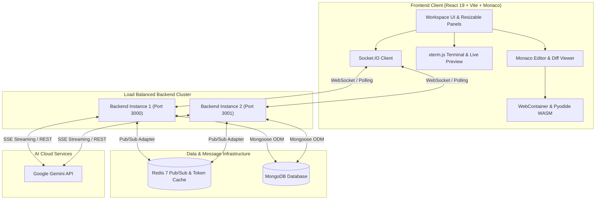
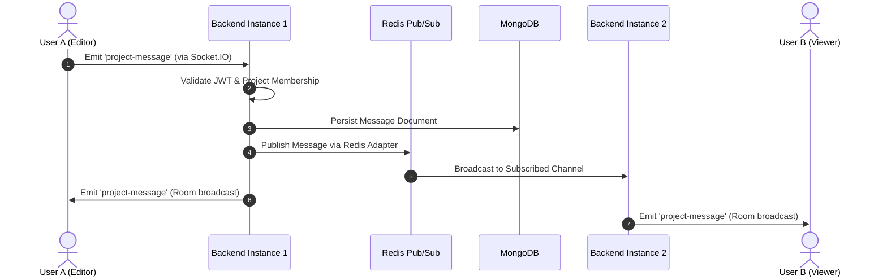
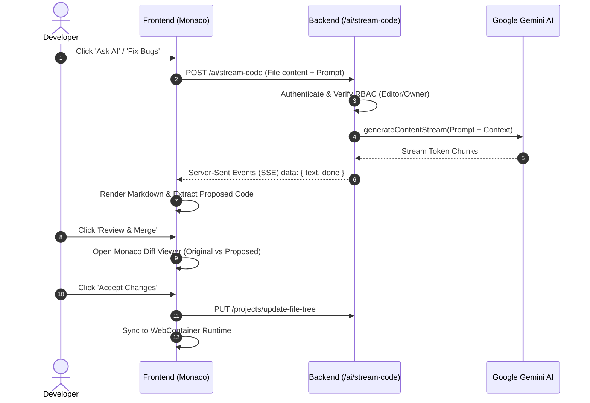

# CodeForge

> **Collaborative AI-Powered Cloud IDE with In-Browser Execution & Real-Time Sync**  
> *Write, run, debug, and review code together in real time.*

[](https://react.dev/)
[](https://vitejs.dev/)
[](https://tailwindcss.com/)
[](https://microsoft.github.io/monaco-editor/)
[](https://nodejs.org/)
[](https://expressjs.com/)
[](https://www.mongodb.com/)
[](https://redis.io/)
[](https://socket.io/)
[](https://ai.google.dev/)
[](https://www.docker.com/)

---

## 📸 Preview


---

## 📑 Table of Contents

- [Overview](#-overview)
- [Why CodeForge?](#-why-codeforge)
- [Core Features](#-core-features)
  - [1. Real-Time Collaboration & Horizontal Scaling](#1-real-time-collaboration--horizontal-scaling)
  - [2. Streaming AI Coding Assistant & Monaco Diff Viewer](#2-streaming-ai-coding-assistant--monaco-diff-viewer)
  - [3. Professional Monaco Code Editor](#3-professional-monaco-code-editor)
  - [4. In-Browser Execution (WebContainer & Pyodide WASM)](#4-in-browser-execution-webcontainer--pyodide-wasm)
  - [5. Role-Based Access Control (RBAC) & Security](#5-role-based-access-control-rbac--security)
  - [6. Dynamic Ergonomic Workspace](#6-dynamic-ergonomic-workspace)
- [System Architecture](#-system-architecture)
  - [High-Level Architecture](#high-level-architecture)
  - [Real-Time Horizontal Scaling Flow](#real-time-horizontal-scaling-flow)
  - [AI Code Generation & Diff Merge Flow](#ai-code-generation--diff-merge-flow)
- [Role-Based Access Control (RBAC) Matrix](#-role-based-access-control-rbac-matrix)
- [Technology Stack](#-technology-stack)
- [Project Structure](#-project-structure)
- [API & Socket Reference](#-api--socket-reference)
  - [REST API Endpoints](#rest-api-endpoints)
  - [Socket.IO Events](#socketio-events)
- [Getting Started Locally](#-getting-started-locally)
  - [Prerequisites](#prerequisites)
  - [1. Clone Repository](#1-clone-repository)
  - [2. Configure Environment Variables](#2-configure-environment-variables)
  - [3. Install Dependencies](#3-install-dependencies)
  - [4. Run in Development Mode](#4-run-in-development-mode)
- [Docker Deployment & Multi-Instance Setup](#-docker-deployment--multi-instance-setup)
- [Automated Testing & Security Verification](#-automated-testing--security-verification)
- [License](#-license)

---

## 💡 Overview

**CodeForge** is a full-stack, cloud-native collaborative development workspace that combines real-time multi-user communication, full-featured in-browser code execution, an embedded Google Gemini AI assistant with visual diff reviews, and enterprise-grade role-based access control.

Unlike conventional online pastebins or simple playgrounds, CodeForge provides an authentic IDE workflow directly in the browser: developers can create nested file structures, execute full Node.js applications in client-side WebContainers, run Python code through WebAssembly, stream AI code modifications with side-by-side diff approvals, and collaborate across multiple load-balanced server instances backed by Redis Pub/Sub.

---

## 🎯 Why CodeForge?

### The Problem
1. **Environment Setup Friction**: Onboarding developers or reviewing code often requires cloning repositories, configuring runtime versions, installing system dependencies, and debugging OS-specific issues.
2. **Disconnected AI Assistance**: Traditional AI chat interfaces force developers to copy-paste code back and forth between a separate browser tab and their local editor, leading to context loss and accidental overwrites.
3. **Single-Node Collaboration Bottlenecks**: Many real-time web applications rely on in-memory WebSocket rooms, breaking cross-user synchronization when backend services scale horizontally behind load balancers.
4. **Weak Security & IDOR Vulnerabilities**: Collaborative tools often lack fine-grained role enforcement, allowing unauthorized viewers or non-members to mutate files, execute unauthorized processes, or view sensitive team chats.

### The CodeForge Solution
- **Zero-Install Cloud IDE**: Run Node.js microservices and Python scripts directly inside the browser using WebContainers and Pyodide WebAssembly without requiring local runtimes or remote VM provisioning.
- **Embedded AI with Visual Diff Merging**: Stream AI code enhancements directly against the active file and review additions/deletions side-by-side in Monaco Diff Editor before committing changes.
- **Distributed Real-Time Sync**: Synchronize chat, typing indicators, and workspace events across horizontally scaled backend servers via a Redis Pub/Sub adapter.
- **Strict Multi-Tenant RBAC**: Multi-tier permission enforcement (Owner, Editor, Viewer) at the HTTP, database, and WebSocket layers protects against IDOR attacks, unauthorized file mutations, and privilege escalation.

---

## ✨ Core Features

### 1. Real-Time Collaboration & Horizontal Scaling
- **Project-Isolated Socket Rooms**: Authenticated WebSocket connections join isolated project rooms (`socket.join(roomId)`), preventing cross-project eavesdropping.
- **Redis Pub/Sub Message Broker**: Multi-instance horizontal scaling powered by `@socket.io/redis-adapter` and `redis`. Messages sent to one backend instance (e.g. Port 3000) are instantly relayed to users connected to any other backend instance (e.g. Port 3001).
- **Persistent Chat History**: Chat messages and AI interactions are persisted in MongoDB with a compound index (`{ projectId: 1, createdAt: -1 }`) supporting high-speed cursor pagination.
- **Real-Time Typing Indicators & Toasts**: Instant visual feedback when collaborators are typing, plus toast notifications and unread badges when the chat sidebar is collapsed.
- **Graceful Single-Node Fallback**: Automatically falls back to in-memory socket broadcasting if Redis is temporarily unreachable, maintaining uninterrupted uptime.

### 2. Streaming AI Coding Assistant & Monaco Diff Viewer
- **Powered by Google Gemini**: Leverages Google Generative AI SDK with automated multi-model fallback (`gemini-flash-latest`, `gemini-flash-lite-latest`, `gemini-3.5-flash`, `gemini-2.5-flash`).
- **Server-Sent Events (SSE) Token Streaming**: Streams AI responses token-by-token via `POST /ai/stream-code` with live syntax highlighting and markdown rendering.
- **Context-Aware File Prompts**: Automatically injects the active file name, language, source code, and project file tree into the prompt context.
- **Quick Action Presets**: One-click actions for **Fix Bugs**, **Optimize Performance**, **Explain Code**, **Add Comments**, and **Refactor Architecture**.
- **Side-by-Side Monaco Diff Viewer**: AI-generated code is never applied blindly. The diff viewer presents additions in green and deletions in red with 1-click **Accept Changes** or **Reject Changes**.
- **Chat `@ai` Command**: Trigger full-project scaffolding or multi-file solutions directly in the collaborative chat by mentioning `@ai`.

### 3. Professional Monaco Code Editor
- **VS Code Core**: Microsoft Monaco Editor (`@monaco-editor/react`) delivering native VS Code editing fidelity.
- **Multi-Language Syntax Highlighting**: Native support for JavaScript, TypeScript, JSX, TSX, Python, HTML, CSS, JSON, and Markdown.
- **Multi-Tab File Management**: Open, switch, and close multiple files with unsaved modification indicators (amber badges).
- **Keyboard Shortcuts**: Built-in keybindings including `Ctrl + S` / `Cmd + S` for instant file saving.
- **Customizable Preferences**: Adjust themes (VS Dark, Light), font size, tab size (2, 4, 8 spaces), word wrapping, and minimap visibility.
- **Status Telemetry**: Real-time cursor position tracking (Line, Column), file language detection, and save status indicators.

### 4. In-Browser Execution (WebContainer & Pyodide WASM)
- **Node.js WebContainer Runtime**: Executes real Node.js processes, `npm install`, and development servers in-browser via `@webcontainer/api` with strict `COOP` and `COEP` security headers.
- **Interactive xterm.js Terminal**: Full-featured terminal emulator (`xterm` + `xterm-addon-fit`) connected to the WebContainer `jsh` shell.
- **Live Port Detection & Browser Preview**: Detects active server ports (`server-ready` event) and renders a live, interactive browser preview iframe alongside your code.
- **Client-Side Python Execution (Pyodide)**: Runs Python scripts locally in WebAssembly (CPython compiled to WASM) with direct stdout and stderr piping to xterm.js.
- **One-Click Run Dispatcher**: Automatically identifies file entry points (`node file.js`, `python script.py`, `npm start`) and dispatches execution to the terminal.

### 5. Role-Based Access Control (RBAC) & Security
- **3-Tier Permission Hierarchy**:
  - **Owner**: Full authority (file mutations, AI code generation, code execution, member invitations, role demotions/promotions, project deletion).
  - **Editor**: Collaborative permissions (file read/write/delete, code execution, AI modifications, chat participation).
  - **Viewer**: Read-only observation (view files, read chat history, view AI output). Blocked from editing files, sending messages, running terminal commands, or modifying project state.
- **Anti-IDOR Protection**: Validates user membership on every HTTP endpoint and WebSocket handshake before returning project data or establishing room subscriptions.
- **Secure Authentication**: Passwords hashed with `bcrypt` (10 rounds), verified with stateless 24-hour JSON Web Tokens (`jsonwebtoken`).
- **Redis Token Blacklisting**: Instant token invalidation on `/users/logout` stored in Redis with 24-hour expiration TTL.

### 6. Dynamic Ergonomic Workspace
- **Drag-to-Resize Panels**: Smooth horizontal drag resizing for the collaborative sidebar (280px–480px) and vertical drag resizing for the terminal drawer (120px–650px).
- **Layout Memory**: Workspace preferences and sidebar widths persist across browser reloads via `localStorage`.
- **Nested File Explorer**: Hierarchical directory tree rendering with file-type specific icons, subfolder creation, and file deletion.
- **Adaptive Monaco Resize**: Custom event debouncing ensures Monaco Editor and xterm.js automatically re-layout when panels open, close, or resize.

---

## 🏗️ System Architecture

### High-Level Architecture



---

### Real-Time Horizontal Scaling Flow



---

### AI Code Generation & Diff Merge Flow



---

## 🛡️ Role-Based Access Control (RBAC) Matrix

| Feature / Action | Owner | Editor | Viewer | Enforcement Layer |
| :--- | :---: | :---: | :---: | :--- |
| **View Project Workspace** | ✅ | ✅ | ✅ | `requireProjectRole(['owner', 'editor', 'viewer'])` |
| **Read Project Files & Tree** | ✅ | ✅ | ✅ | `GET /projects/get-project/:projectId` |
| **Read Chat History** | ✅ | ✅ | ✅ | `GET /projects/:projectId/messages` |
| **Send Chat Messages** | ✅ | ✅ | ❌ | Socket.IO Middleware (`socket.userRole !== 'viewer'`) |
| **Modify / Save Files** | ✅ | ✅ | ❌ | `PUT /projects/update-file-tree` |
| **Create Files & Folders** | ✅ | ✅ | ❌ | Frontend + Backend `updateFileTree` |
| **Delete Files & Folders** | ✅ | ✅ | ❌ | Frontend + Backend `updateFileTree` |
| **Run Code in Terminal** | ✅ | ✅ | ❌ | Frontend Terminal Guard |
| **Request AI Code Stream** | ✅ | ✅ | ❌ | `POST /ai/stream-code` (403 for Viewers) |
| **Invite New Members** | ✅ | ❌ | ❌ | `PUT /projects/add-user` (Owner Only) |
| **Change Member Roles** | ✅ | ❌ | ❌ | `PUT /projects/update-member-role` (Owner Only) |
| **Remove Project Members** | ✅ | ❌ | ❌ | `DELETE /projects/remove-member` (Owner Only) |
| **Delete Project** | ✅ | ❌ | ❌ | `DELETE /projects/:projectId` (Owner Only) |

---

## 🛠️ Technology Stack

### Frontend
- **Core**: React 19 (`19.2.5`), Vite (`8.0.10`), JavaScript (ES Modules)
- **Editor**: `@monaco-editor/react` (`4.7.0`)
- **Terminal & Execution**: `xterm` (`5.3.0`), `xterm-addon-fit` (`0.8.0`), `@webcontainer/api` (`1.6.4`), Pyodide WASM (`v0.26.2`)
- **Styling**: Tailwind CSS v4 (`4.2.4`), Custom CSS Tokens, Glassmorphism
- **Real-Time Client**: `socket.io-client` (`4.8.3`)
- **Routing & Networking**: `react-router-dom` (`7.14.2`), `axios` (`1.15.2`)
- **Markdown & Syntax**: `markdown-to-jsx` (`9.7.16`), `highlight.js` (`11.11.1`), `remixicon` (`4.9.1`), `react-icons` (`5.6.0`)

### Backend
- **Server Runtime**: Node.js 20+, Express 5 (`5.2.1`), `http`
- **Database**: MongoDB, Mongoose (`9.5.0`)
- **Caching & Broker**: Redis (`6.2.0`), `ioredis` (`5.10.1`), `@socket.io/redis-adapter` (`8.3.0`)
- **Real-Time Server**: `socket.io` (`4.8.3`)
- **Authentication**: `jsonwebtoken` (`9.0.3`), `bcrypt` (`6.0.0`), `cookie-parser` (`1.4.7`)
- **Validation & Logging**: `express-validator` (`7.3.2`), `morgan` (`1.10.1`)
- **AI Integration**: Google Generative AI SDK (`@google/generative-ai` `0.24.1`)

### DevOps & Infrastructure
- **Containerization**: Docker, Docker Compose
- **Security**: IDOR protection, JWT Blacklisting, Server-Sent Events, COOP/COEP isolation

---

## 📁 Project Structure

```text
CodeForge/
├── docker-compose.yml              # Multi-instance orchestration (Redis + MongoDB + 2 Backends)
├── README.md                       # Comprehensive project documentation
├── backend/
│   ├── app.js                      # Express application setup, routes, middleware, /health telemetry
│   ├── server.js                   # HTTP server, Socket.IO auth, Redis adapter, room event handlers
│   ├── Dockerfile                  # Production-ready Node.js container build
│   ├── controllers/
│   │   ├── ai.controllers.js       # SSE streaming & prompt generation controllers
│   │   ├── message.controllers.js  # Cursor-paginated message history controller
│   │   ├── project.controllers.js  # Project CRUD, fileTree updates, member management
│   │   └── user.controllers.js     # User registration, login, profile, Redis logout
│   ├── db/
│   │   └── db.js                   # Mongoose MongoDB connection initializer
│   ├── middleware/
│   │   ├── auth.middleware.js      # JWT verification & Redis blacklist validator
│   │   └── rbac.middleware.js      # Reusable role-based access control middleware
│   ├── models/
│   │   ├── message.model.js        # Chat message schema with compound pagination index
│   │   ├── project.model.js        # Project schema with members, owner, and getUserRole()
│   │   └── user.model.js           # User schema with bcrypt hashing & JWT generation
│   ├── routes/
│   │   ├── ai.routes.js            # Routes for AI generation and SSE streaming
│   │   ├── project.routes.js       # Protected project management & RBAC routes
│   │   └── user.routes.js          # Authentication & user directory routes
│   ├── services/
│   │   ├── ai.service.js           # Gemini SDK wrapper, streaming logic, model fallback
│   │   ├── message.service.js      # Message creation and cursor pagination query logic
│   │   ├── project.service.js      # Project mutations, legacy migrations, member roles
│   │   ├── rbac.service.js         # Centralized permissions matrix and helpers
│   │   ├── redis.service.js        # Redis Pub/Sub adapter, key-value blacklist helpers
│   │   └── user.service.js         # User registration and query business logic
│   ├── test_horizontal_scaling.js  # Automated verification for multi-server Redis sync
│   └── test_rbac_security.js       # Automated suite of 9 RBAC & IDOR security attack tests
└── frontend/
    ├── vite.config.js              # Vite configuration with COOP/COEP headers for WebContainer
    ├── package.json                # Frontend dependencies and build scripts
    ├── public/                     # Static assets (favicon, svg icons)
    └── src/
        ├── App.jsx                 # Application root with context provider wrapping
        ├── main.jsx                # React DOM entry point
        ├── index.css               # Design system tokens, glassmorphism, scrollbar styles
        ├── auth/
        │   └── UserAuth.jsx        # Protected route wrapper with profile session validation
        ├── components/
        │   ├── AiAssistantPanel.jsx# Side drawer for SSE streaming AI assistance
        │   ├── AiDiffModal.jsx     # Side-by-side Monaco Diff Viewer with merge approval
        │   ├── AskAiModal.jsx      # Quick-action modal for contextual file instructions
        │   ├── CodeEditor.jsx      # Monaco Editor wrapper with tabs, settings, and keybindings
        │   ├── FileExplorer.jsx    # Hierarchical file tree with folder creation and icons
        │   └── Terminal.jsx        # xterm.js terminal with WebContainer & Pyodide integration
        ├── config/
        │   ├── axios.js            # Axios client with automatic Bearer token interceptor
        │   ├── pythonRunner.js     # Pyodide WebAssembly runtime loader and runner
        │   ├── socket.js           # Singleton Socket.IO client manager
        │   └── webContainer.js     # Singleton WebContainer boot manager and tree converter
        ├── context/
        │   └── user.context.jsx    # React Context for authenticated user session state
        ├── routes/
        │   └── AppRoutes.jsx       # Client-side routing configuration
        └── screens/
            ├── Home.jsx            # Landing page & authenticated project dashboard
            ├── Login.jsx           # User login screen with validation
            ├── Project.jsx         # Full IDE workspace (Editor, Chat, AI, Terminal, Preview)
            └── Register.jsx        # User registration screen
```

---

## 📡 API & Socket Reference

### REST API Endpoints

#### Authentication (`/users`)
| Method | Endpoint | Description | Auth Required |
| :--- | :--- | :--- | :---: |
| `POST` | `/users/register` | Register new user account (`email`, `password`) | No |
| `POST` | `/users/login` | Authenticate user and receive JWT token | No |
| `GET` | `/users/profile` | Retrieve profile information for authenticated user | Yes |
| `GET` | `/users/logout` | Invalidate active token via Redis blacklist | Yes |
| `GET` | `/users/all` | List all users for collaborator invitation search | Yes |

#### Projects (`/projects`)
| Method | Endpoint | Description | Required Role |
| :--- | :--- | :--- | :---: |
| `POST` | `/projects/create` | Create a new project (creator becomes Owner) | Authenticated |
| `GET` | `/projects/all` | Get all projects where user is Owner, Editor, or Viewer | Authenticated |
| `GET` | `/projects/get-project/:projectId` | Get project metadata, members, and fileTree | Viewer / Editor / Owner |
| `GET` | `/projects/:projectId/messages` | Get cursor-paginated chat history (`before`, `limit`) | Viewer / Editor / Owner |
| `PUT` | `/projects/update-file-tree` | Save / update project fileTree structure | Editor / Owner |
| `PUT` | `/projects/add-user` | Invite collaborators with `editor` or `viewer` role | Owner Only |
| `PUT` | `/projects/update-member-role` | Change member role between `editor` and `viewer` | Owner Only |
| `DELETE`| `/projects/remove-member` | Remove a collaborator from the project | Owner Only |
| `DELETE`| `/projects/:projectId` | Permanently delete project | Owner Only |

#### AI Services (`/ai`)
| Method | Endpoint | Description | Required Role |
| :--- | :--- | :--- | :---: |
| `GET` | `/ai/get-result` | Synchronous Gemini prompt generation (`?prompt=...`) | No |
| `POST` | `/ai/stream-code` | Server-Sent Events (SSE) token streaming for code generation | Editor / Owner |

#### Health & Telemetry
| Method | Endpoint | Description |
| :--- | :--- | :--- |
| `GET` | `/health` | Server uptime, MongoDB connection state, and Redis status |

---

### Socket.IO Events

| Event Name | Direction | Payload Structure | Description |
| :--- | :---: | :--- | :--- |
| `connection` | Client ➔ Server | `auth: { token }, query: { projectId }` | Authenticates socket and joins project room |
| `project-message` | Client ➔ Server | `{ message: string, sender: object }` | Sends message to project room (blocked for Viewers) |
| `project-message` | Server ➔ Client | `{ _id, projectId, sender, message, type, createdAt }` | Broadcasts persisted message to all room members |
| `typing` | Client ➔ Server | `{ isTyping: boolean }` | Notifies server of user typing state |
| `user-typing` | Server ➔ Client | `{ userId, email, isTyping }` | Relays typing indicator to other room members |
| `error-message` | Server ➔ Client | `{ message: string }` | Emits validation or permission errors to client |

---

## 🚀 Getting Started Locally

### Prerequisites
Make sure you have the following installed on your machine:
- **Node.js**: `v20.0.0` or higher
- **npm**: `v10.0.0` or higher
- **MongoDB**: Local MongoDB instance running on `mongodb://127.0.0.1:27017` (or MongoDB Atlas URI)
- **Redis**: Local Redis server running on `redis://127.0.0.1:6379`
- **Google Gemini API Key**: Obtain a free API key from [Google AI Studio](https://aistudio.google.com/)

---

### 1. Clone Repository

```bash
git clone https://github.com/your-username/CodeForge.git
cd CodeForge
```

---

### 2. Configure Environment Variables

Create local `.env` files based on the provided `.env.example` templates:

```bash
# Copy backend environment template
cp backend/.env.example backend/.env

# Copy frontend environment template
cp frontend/.env.example frontend/.env
```

#### Backend Environment Variables (`backend/.env`)
```env
PORT=8080
MONGO_URI=mongodb://127.0.0.1:27017/SOEN
JWT_SECRET=your_jwt_secret_here
REDIS_URL=redis://127.0.0.1:6379
GOOGLE_AI_KEY=your_gemini_api_key_here
```

#### Frontend Environment Variables (`frontend/.env`)
```env
VITE_API_URL=http://localhost:8080
```

---

### 3. Install Dependencies

```bash
# Install backend dependencies
cd backend
npm install

# Install frontend dependencies
cd ../frontend
npm install
```

---

### 4. Run in Development Mode

In two separate terminal windows:

#### Terminal 1 — Start Backend API & Socket Server
```bash
cd backend
npm run dev
# Server will run on http://localhost:8080
```

#### Terminal 2 — Start Frontend Development Server
```bash
cd frontend
npm run dev
# Vite app will run on http://localhost:5173
```

Open your browser and navigate to `http://localhost:5173` to start creating projects!

---

## 🐳 Docker Deployment & Multi-Instance Setup

CodeForge includes a complete `docker-compose.yml` configuration that boots:
1. **Redis 7 Alpine** message broker with volume persistence.
2. **MongoDB** database with volume persistence.
3. **Backend Instance 1** on port `3000`.
4. **Backend Instance 2** on port `3001` (demonstrating cross-server Redis socket synchronization).

To start the entire containerized cluster:

```bash
# Set your Gemini API key in your terminal environment
export GOOGLE_AI_KEY=your_gemini_api_key_here

# Build and start all services
docker compose up --build
```

To stop all services:
```bash
docker compose down
```

---

## 🧪 Automated Testing & Security Verification

CodeForge includes comprehensive automated testing scripts designed to validate distributed real-time synchronization and security resilience.

### 1. Test Horizontal Scaling via Redis Pub/Sub
Verifies that two independent Socket.IO servers (running on different ports) seamlessly relay messages between connected clients via Redis:

```bash
cd backend
node test_horizontal_scaling.js
```

**What this test asserts:**
- Spawns Server 1 on Port 9001 and Server 2 on Port 9002 with shared Redis adapter.
- Connects Client A to Server 1 and Client B to Server 2.
- Verifies that messages sent from Client A to Server 1 arrive at Client B on Server 2.
- Verifies reverse bidirectional communication from Server 2 back to Server 1.

---

### 2. Test RBAC & Security Attack Scenarios
Verifies the backend authorization layer against 9 real-world security vectors:

```bash
cd backend
node test_rbac_security.js
```

**What this test suite verifies:**
1. 🛡️ **IDOR Attack Prevention**: Rejects non-members attempting to view project data with `403 Forbidden`.
2. 🛡️ **Viewer File Mutation Guard**: Blocks viewers attempting unauthorized file writes (`PUT /update-file-tree`) with `403 Forbidden`.
3. 🛡️ **Viewer AI Modification Guard**: Blocks viewers attempting to trigger AI code modification streams with `403 Forbidden`.
4. 🛡️ **Privilege Escalation Defense**: Prevents editors from inviting new members (`PUT /add-user`) with `403 Forbidden`.
5. 🛡️ **Destruction Attack Prevention**: Prevents non-owners from deleting projects with `403 Forbidden`.
6. 🛡️ **Legitimate Editor Verification**: Validates that authorized editors can successfully edit and save files (`200 OK`).
7. 🛡️ **Role Modification Verification**: Validates that owners can change member roles (`editor` ➔ `viewer`).
8. 🛡️ **Demotion Enforcement**: Asserts that demoted users are immediately blocked from file modifications.
9. 🛡️ **Owner Project Deletion**: Asserts that legitimate project owners can permanently delete projects.

---

## 🤝 Contributing

Contributions, issues, and feature requests are welcome!

1. Fork the repository
2. Create your feature branch (`git checkout -b feature/AmazingFeature`)
3. Commit your changes (`git commit -m 'Add some AmazingFeature'`)
4. Push to the branch (`git push origin feature/AmazingFeature`)
5. Open a Pull Request

---

## 📄 License

This project is licensed under the **ISC License**.

---

<p align="center">
  <sub>Built with ❤️ for modern collaborative software engineering.</sub>
</p>
